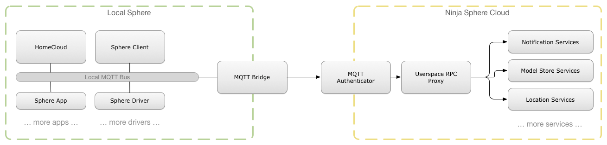

Cloud RPC Services
==================

The Ninja Sphere platform makes extensive use of MQTT, both for local communication between components running on a Spheramid, but also between the Spheramid and the Sphere Cloud.

Certain topics on the *local bus* are bridged to the *cloud bus*, allowing not only for state and actuations to flow to the cloud and back, but also for asyncronous RPC requests to be performed against cloud services.

Additionally, the cloud can also inject additional helper channels to devices to add extra functionality that otherwise wouldn't be possible (or feasible), such as push notifications to mobile devices.

|

The following services are currently available in the Sphere cloud:

.. toctree::
  :maxdepth: 1

  notifications