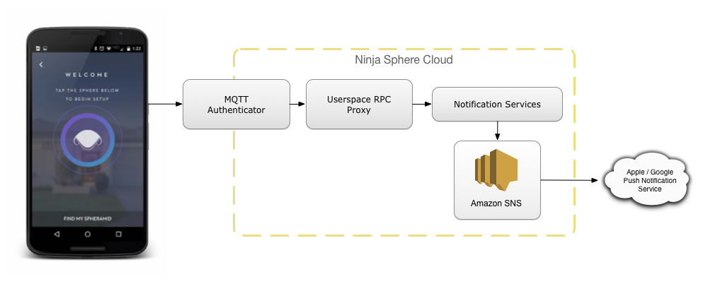
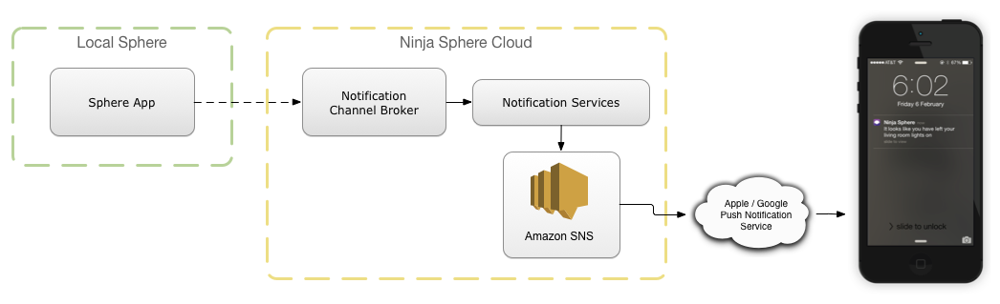

Push Notification Services
==========================

The Push Notification Service allows mobile applications to register for push notifications. Ninja Cloud services, local apps and cloud apps all have RPC access to the notification service via the MQTT bus, however typically apps and services will instead use the notification channel on the mobile device's Thing to send messages rather than using the RPC calls directly.

Registration
------------

|

When a user first runs the Ninja Sphere app on iOS or Android, the phone or tablet registers for push notifications with the native service provider (Apple or Google), and retrieve a token that authenticates future push notifications. The mobile device also registers itself with the Ninja Cloud as a client node, similar to a Spheramid, and connects to the Cloud MQTT endpoint. The mobile device also emits a *device registration*, just like a driver would do, to register itself as an entity in the Sphere system.

The notification token retrieved from the provider is then sent up to the Sphere cloud using the notification RPC service, which is exposed in a limited fashion to the public facing MQTT service for the user via our *Userspace RPC Service*. Once the registration is passed off to the *Notification Service*, we then register the token for future notifications, currently using *Amazon SNS* (though because of the design, the underlying service is actually abstracted away).

After the device notification token is registered, the cloud does something interesting - it emits a new channel on the device previously registered, with the *notification protocol*. This channel will look something like:

.. code-block:: javascript

	{
		"topic": "$device/abcdef0123/channel/cloud-push-notification",
		"schema": "http://schema.ninjablocks.com/protocol/notification",
		"supportedMethods": [
			"display"
		],
		"supportedEvents": [ ],
		"id": "cloud-push-notification",
		"protocol": "notification",
		"deviceId": "abcdef0123",
		"lastState": null
	}

Notification Channel
--------------------

When an app wants to send a notification, it will usually do so by actuating a channel that uses the *notification protocol*. This protocol is not specific to "push notifications", and for example can be used by any system that supports notifications, such as XBMC/Kodi.

As we saw above, the Ninja cloud registers a notification channel for push notifications on a mobile device. When an app calls a method on the Thing, say *Sally's Phone* which is bound to that device, the following flow occurs (providing an internet connection is available at the time):

The cloud service automatically routes the message out to the appropriate device's push notification service, and the user receives the notification.

For example, an actuation might be emitted using the ``display`` method, which would translate to the following MQTT publish on topic ``$device/abcdef0123/channel/cloud-push-notification``:

.. code-block:: javascript
	
	{
		"jsonrpc": "2.0",
		"method": "display",
		"params": [
			{
				"title": "Hey, this is pretty darn cool!"
			}
		],
		"id": "..."
	}

Notification Actions
--------------------

Part of modern push notifications is the (optional) ability for a user to action the item after it is sent. This is supported as well, with one caveat: for push notifications that are possibly destined for an **iOS device**, actions will only work if the actions **exactly match** those pre-configured in the Ninja Sphere app. If you've seen one on the app (like "Turn Off", "Ignore", exactly in that order), then it will work, regardless of the responses you tie to them. If you use any non-registered action names, the notification will not arrive on the iOS device at all. This is an unfortunate limitation of the iOS notification action API.

An example notification with actions:

.. code-block:: javascript
	
	{
		"jsonrpc": "2.0",
		"method": "display",
		"params": [
			{
				"title": "I'm afraid I can't let you leave your light on, Dave",
				"replyTo": {
					"topic": "some/mqtt/topic",
					"method": "doTheThing"
				},
				"data": {
					"action": "unknown",
					"hal": 2000
				},
				"actions": [
					{
						"label": "Turn Off",
						"type": "reply",
						"name": "action",
						"value": "turn-off",
					},
					{
						"label": "Ignore",
						"type": "reply",
						"name": "action",
						"value": "ignore"
					}
				]
			}
		],
		"id": "..."
	}

The fields tell the application which actions to show, and how to handle the actions when the user taps them. To start with, the ``replyTo`` field specifies an MQTT topic which the response will be sent to, along with a method, which will be used for the JSON-RPC payload. The ``data`` field then specifies the default data that will be sent as the first parameter to that RPC method.

In this case, all actions are ``type="reply"``, and this is the only action type currently supported on our mobile applications. Depending on the action the user specifies, the field ``action`` in the default ``data`` parameter will then have its value changed to the ``value`` specified before the message is sent.

This means the following RPC will be sent to the topic ``some/mqtt/topic`` if the user hits *Turn Off*:

.. code-block:: javascript
	
	{
		"jsonrpc": "2.0",
		"method": "doTheThing",
		"params": [
			{
				"action": "turn-off",
				"hal": 2000
			}
		],
		"id": "..."
	}

The application is then able to subscribe to this topic and perform some action. Note that this response is **always** sent via the Sphere Cloud, and only a limited subset of topics are bridged back down to the device. This will be documented further soon, and more so when the bridge code is open sources, but for now ping us on the forums for details if you are going to implement something using push notifications, we'll be glad to help.