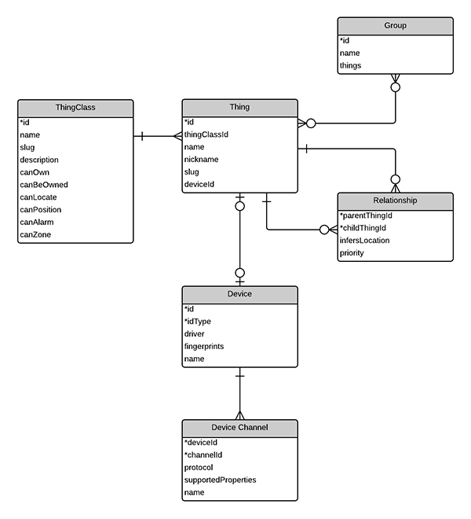

Device
======

A ``Device`` is a view of a single physical device or virtual device (third party web service etc). A device itself is not actuated, it must provide channels for that. The primary key is a composite of a natural key provided by the driver (id) and an id type (used to discriminate between potentially overlapping key spaces).

**Examples:**

::

  zigbee-0017abc5c2519c (a StickNFind)
  dropbox-18282614451 (DropBox account)
  ip-192.168.1.2:3000 (an XBMC instance)

Driver name and version should also be stored with the device to aid debugging and provide more sensible updates.

Fingerprints are clues found that can help indicate the model, brand, manufacturer etc. They can be used alone by widgets and optionally extended using ConnectedDevic.es to add logos/descriptions etc.

