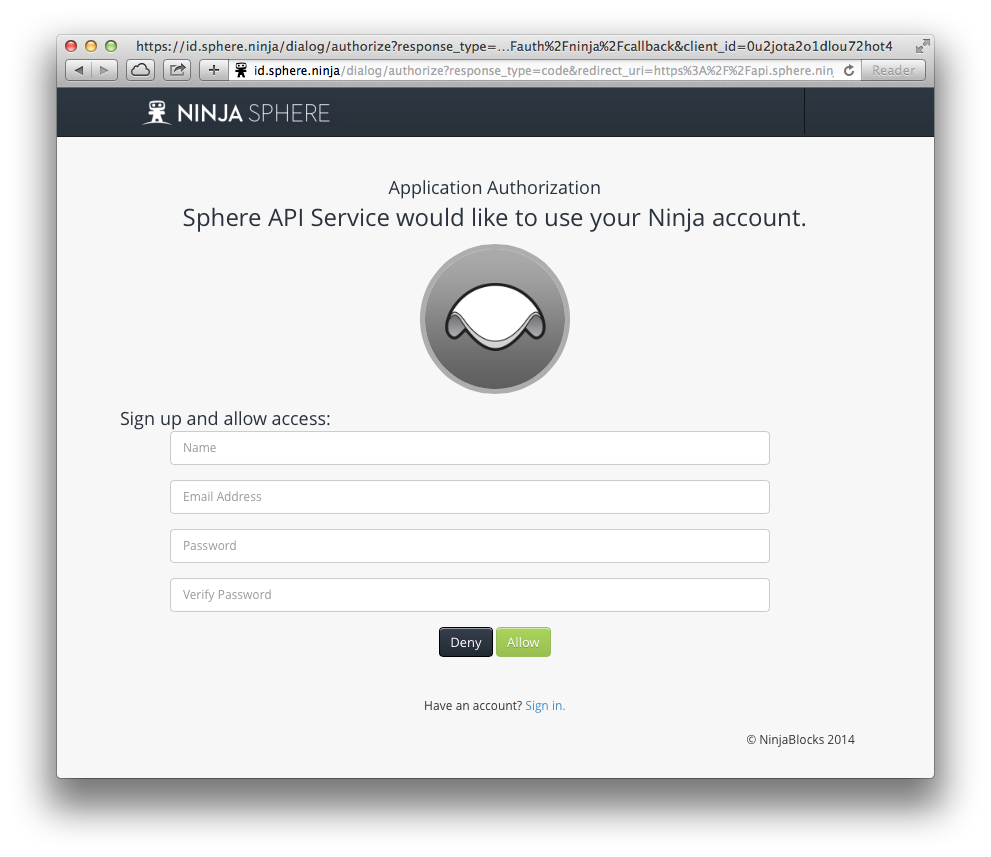
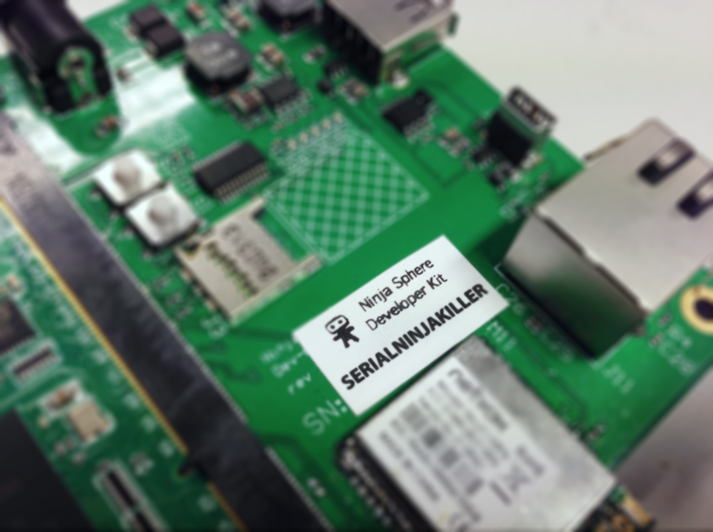

Pairing your developer kit
==========================

Visit ``http://ninjasphere`` or ``http://<your devkit ip>`` in your web browser. Since the Dev Kit is not yet activated with the Ninja Sphere Cloud, it will redirect you to the cloud.

Create an account
-----------------

If you haven't paired a Dev Kit to the new Ninja Cloud before, you will now need to create an account. Note that this is a completely different identity to the one used with the existing Ninja Blocks platform.

You should see the following screen:

.. image:: images/pairing-signin.png
  :width: 60%
  :align: center

Tap the "sign up" link at the bottom of the screen and you should see a sign up page:

Enter your name, a valid email address and a password, then click allow.

Pair using your serial number
-----------------------------

You will now see a screen asking you to enter a serial number. Your Dev Kit has a unique serial number, allowing us to identify it.

Enter this serial number in the box and follow the on-screen instructions to get back to your Dev Kit.

.. image:: images/pairing-complete.png
  :width: 60%
  :align: center

Once completed, you will now be on your local Dev Kit's web interface. You can get back to this at any time by visiting ``http://ninjasphere`` or ``http://<your devkit ip>``. This page would be a good idea to bookmark, since you'll want to get back there regularly as you use your Dev Kit.
