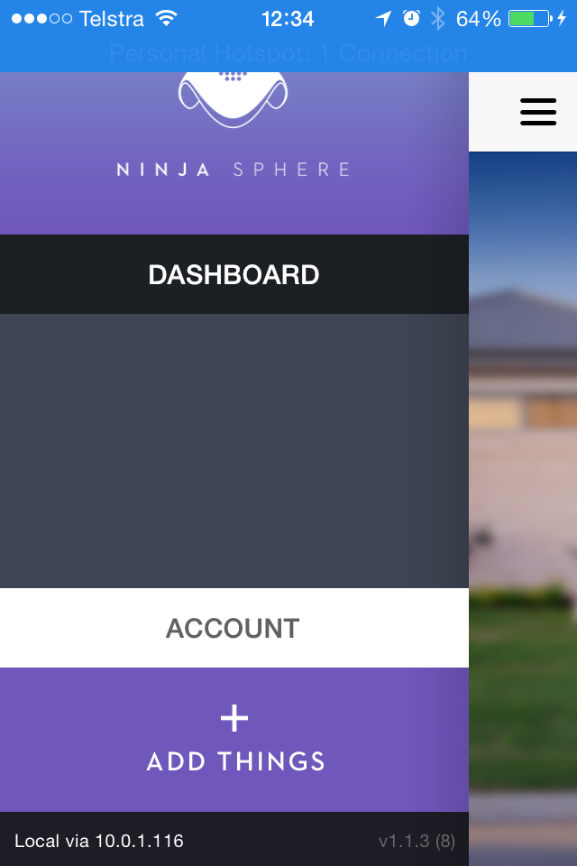

Factory Resetting a Ninja Smart Power Socket
==============================================

.. image:: images/socket.jpg

Step 1
~~~~~~~~~~~~~
Unplug your socket from the wall.

Step 2
~~~~~~~~~~~~~
Using a pen or something pointy, push the "reset" button on the right hand side of the socket. With the reset button still pressed, plug the socket back into the wall. The LEDs should rapidly flash green.

Step 3
~~~~~~~~~~~~~
Stop pressing the button and remove the plug fom the wall. Wait a moment until the LEDs turn off, then plug back in. Your socket has now been factory reset.

Step 4
~~~~~~~~~~~~~
Open the phone app and navigate to the "Add Things" page. After a few seconds, an icon representing the new socket should appear in the list of things to add. Select the icon, then hit the next button, select the type of thing controlled by the socket, select the room to place the thing in and then hit save.

Troubleshooting
~~~~~~~~~~~~~
It didn't work! Now what?

* Make sure you've allowed some time for the socket to power down after unplugging. You can tell when its ready to plug in when the LEDs have fully discharged.

* Using a web browser, visit http://ninjasphere.local:8000/rest/v1/things/ this will show the list of devices that the sphere has seen - if the socket has been recognized then the text: "zigbee:ModelIdentifier": "Ninja Smart Plug" should appear somewhere in the list. If not, try repeating Steps 2 - 4 of the process.

* Check that the Ninja Sphere is on a local route, rather than a cloud route, as per the message "Local via x.x.x.x" that should appear at the bottom left of the menu.

If not, try doing a "green" reset of the sphere by holding down the reset button until the LED turns green and then releasing it. This will reboot the sphere. Wait for 30 seconds after the clock fades, confirm that the phone app is connected to the local route, and then retry steps 2 - 4 of the process.

* If you are still having trouble, contact Ninja Blocks Support - support@ninjablocks.com

